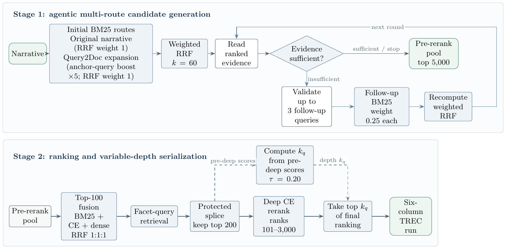

# TREC RAG 2026 — CFDA Final Pipeline

[](https://github.com/AnnieHsieh-12/TREC_RAG_2026/actions/workflows/ci.yml)

This repository presents CFDA's final system for the TREC RAG 2026 track. It
combines multi-route retrieval, neural reranking, adaptive evidence
acquisition, and citation-grounded answer generation.

The system is designed around a simple principle: retrieve broadly, spend
additional search only where the evidence is incomplete, and validate every
answer before serialization. The repository focuses on the final competition
pipeline and excludes development experiments and generated artifacts.

## System overview

The system contains two related pipelines:

| Pipeline | Purpose | Output |
| --- | --- | --- |
| Retrieval | Produce a variable-depth document ranking for each topic | Six-column TREC run |
| Bounded RAG | Acquire sufficient evidence and generate a grounded answer | TREC RAG JSONL |

TypeScript coordinates retrieval and generation, while a local Python service
handles neural reranking, passage selection, and sentence-level evidence
matching. The final generation path uses the OpenAI API.

### Key design choices

- **Adaptive retrieval:** an evidence-sufficiency decision determines whether
  the system stops or searches again.
- **Query diversity with drift control:** the original narrative, Query2Doc,
  and validated follow-up queries contribute through weighted RRF.
- **Protected ranking head:** later facet expansion and deep reranking improve
  coverage without destabilizing the highest-ranked documents.
- **Bounded agent loop:** the RAG pipeline has explicit limits on rounds and
  documents read, making its behavior auditable and cost-controlled.
- **Grounded generation:** answer revision and citation ordering operate on
  retrieved evidence before strict output validation.

## Quickstart: offline validation

Prerequisites: Node.js 22 or newer, Python 3.12, and npm.

The public code paths can be checked without API keys, a GPU, model downloads,
or competition data:

```bash
cd code
npm ci
npm run check
```

This runs formatting and type checks, unit tests, and mocked end-to-end tests
for one Retrieval topic and one RAG topic. A successful run ends with all
TypeScript and Python tests passing. It does not contact ClimbMix, NCHC, or
OpenAI, and it does not exercise GPU inference.

## Retrieval pipeline



For each narrative, the Retrieval pipeline:

1. Runs an anchor BM25 search using the original narrative.
2. Generates one Query2Doc pseudo-document and runs one expanded BM25 search.
   Within this expanded query, the original narrative has a repeat/boost factor
   of 5 to reduce query drift. This is separate from its RRF route weight,
   which remains 1.
3. Fuses the anchor and Query2Doc rankings with weighted reciprocal rank fusion
   (RRF, `k=60`).
4. Reads ranked evidence and asks an LLM whether the evidence is sufficient.
   If not, it validates up to three follow-up BM25 queries, assigns each a
   fusion weight of `0.25`, recomputes RRF, and continues within the configured
   document and iteration budgets.
5. Reranks the top 100 using BM25, cross-encoder, and dense signals with
   `1:1:1` RRF fusion.
6. Retrieves facet queries and splices their pool below a protected top 200.
7. Optionally applies deep cross-encoder reranking to ranks 101–3,000 while
   preserving the top 100.
8. Computes each topic's output depth from the pre-deep scores (`tau=0.20`) and
   writes a six-column TREC run.

The selected Retrieval policy is defined in
[`code/config/final_pipeline.ts`](code/config/final_pipeline.ts).

## Bounded RAG pipeline


For each narrative, the bounded RAG pipeline:

1. Retrieves BM25 top 1,000 and reranks the top 300.
2. Initially reads 12 documents.
3. Uses the supplied facet checklist and currently read evidence to decide
   whether the evidence is sufficient.
4. When evidence is insufficient, validates up to three follow-up queries. If
   a valid query and budget remain, it performs BM25 retrieval, weighted RRF,
   top-300 reranking, and reads 10 previously unseen documents.
5. Repeats until evidence is sufficient, no valid continuation remains, six
   rounds are reached, or 60 documents have been read.
6. Uses the final evidence and checklist to generate a dense cited answer.
7. Trims to 1,020 words, verifies or weakens unsupported claims, trims again,
   orders citations by support strength, and validates the JSON structure. The
   1,020-word internal cap leaves headroom below the organizer limit of 1,024.
8. Applies deterministic finalization and checks formatting, identifiers, and
   topic completeness before writing the submission file.

## Repository layout

```text
TREC_RAG_2026/
├── README.md
├── examples/                       fictional input examples
├── docs/figures/                   pipeline diagrams used in this README
├── .github/workflows/ci.yml        automated checks
├── code/
│   ├── config/final_pipeline.ts    selected final Retrieval policy
│   ├── scripts/                    public run/build/validation entry points
│   ├── src/llm/                    OpenAI, NCHC, and optional Codex clients
│   ├── src/evaluation/             local qrels discovery and metrics
│   ├── src/trec-rag-2026/
│   │   ├── retrieval-pipeline/     final Retrieval controller
│   │   ├── rag-pipeline/           final bounded RAG controller
│   │   ├── retrieval/              retrieval and reranking components
│   │   └── shared-rag/             shared prompts, contracts, and validation
│   ├── tools/                      checklist, deep rerank, finalization, checks
│   └── tests/                      deterministic offline smoke tests
└── sidecar/
    ├── src/sidecar.py              localhost HTTP service
    ├── requirements.lock           fully resolved Python environment
    └── README.md                   endpoint and configuration details
```

## Requirements

- Node.js 22 or newer
- Python 3.12
- Access to the ClimbMix/Pyserini service
- NCHC credentials for the base Retrieval model
- An OpenAI API key for the final Retrieval query/writer roles and bounded RAG
- A CUDA-capable GPU is recommended for neural reranking

Competition services, model weights, and inputs require separate access.

## Installation

From the repository root, install the locked TypeScript dependencies:

```bash
cd code
npm ci
cd ..
```

Create a Python environment and install the pinned reranking and sidecar
dependencies:

```bash
python3 -m venv .venv
source .venv/bin/activate
pip install -r code/requirements-deepce.txt
pip install -r sidecar/requirements.lock
```

## Configuration

Copy the example environment files. The resulting `.env.local` files are
ignored by Git and must not be committed.

```bash
cp code/.env.example code/.env.local
cp sidecar/.env.local.example sidecar/.env.local
```

Configure:

| File | Required values |
| --- | --- |
| `code/.env.local` | `NCHC_API_KEY`, `PYSERINI_API_TOKEN` |
| `sidecar/.env.local` | `PYSERINI_API_TOKEN`, `NCHC_API_KEY` |

`SIDECAR_URL` defaults to `http://127.0.0.1:8765`. The server port can be
changed with `SIDECAR_PORT`; use matching values when changing it.

### Codex authentication for the final RAG pipeline

The final RAG pipeline sends its query-planning and answer-writing calls to
the local sidecar, which invokes Codex CLI. Authenticate Codex on the machine
running the service:

```bash
npm install --global @openai/codex
codex login
codex login status
```

On a headless server, use `codex login --device-auth`. API-key authentication
is also available through `codex login --with-api-key`.

## Official data

This repository does not redistribute the TREC RAG datasets. Download data
from the [official TREC-RAG data repository](https://github.com/TREC-RAG/trec-rag-data):

- [2026 test data](https://github.com/TREC-RAG/trec-rag-data/tree/main/trec-rag-2026/test-data),
  including `trec_rag_2026_queries.tsv`;
- [development data](https://github.com/TREC-RAG/trec-rag-data/tree/main/trec-rag-2026/development-data),
  including development topics and projected UMBRELA qrels.

The development qrels are model-generated diagnostics for development topics;
they are not official judgments for the 119 test topics. Record the source
repository revision or a checksum when using downloaded data. Track schedules
and judgment availability on the [official TREC RAG website](https://trec-rag.github.io/).

## Input files

Topics and a checklist are required. Qrels are optional and are used only for
development diagnostics. Small fictional examples are included.

### Topics TSV

One topic per line, with the exact topic ID and narrative separated by a tab:

```text
topic_id<TAB>narrative
```

See [`examples/topics.example.tsv`](examples/topics.example.tsv).

### Optional qrels directory

Provide a directory containing one or more `*.qrels` files. Filenames are
discovered automatically and are used only for local metric reporting; qrels
are never used to choose queries or evidence. When qrels are supplied, the
pipeline writes `metrics.json`, `per_topic_metrics.json`, and
`qrels_metadata.json`; the last file records each filename and SHA-256. Without
qrels, the normal output is produced and these diagnostic files are omitted.

### Topic-derived checklist

The final RAG launcher first derives a facet checklist from each topic
narrative with the configured NCHC model. It does not use qrels, judgments, or
answer text. The generated checklist guides evidence sufficiency, follow-up
queries, and dense answer structure. Each run stores it as
`generated-checklist.jsonl` under its output directory.

The generator emits only topic-derived aspect titles and vital/okay priority.
It does not predict facts before retrieval; factual claims are obtained from
ClimbMix evidence during the agent loop.

One generated JSON object per topic:

```json
{"qid":"topic_id","items":["first aspect","second aspect"]}
```

See [`examples/checklist.example.jsonl`](examples/checklist.example.jsonl).
To generate a checklist separately for inspection:

```bash
python code/tools/build_checklist.py \
  --topics /path/to/topics.tsv \
  --output /path/to/checklist.jsonl
```

Schema-only output examples are available in
[`examples/retrieval_output.example.tsv`](examples/retrieval_output.example.tsv)
and [`examples/rag_output.example.jsonl`](examples/rag_output.example.jsonl).
They contain fictional IDs and are not competition submissions.

## Start the local neural service

The bounded RAG pipeline calls a small local Python service (the `sidecar`) for
GPU-backed reranking and evidence processing. Start it in a separate terminal
from the repository root:

```bash
source .venv/bin/activate
cd sidecar
python -m src.sidecar
```

It binds only to `127.0.0.1`. At startup it loads or downloads the configured
reranking model into an ignored local cache. Its formal RAG responsibilities
are:

- rerank the current top 300;
- select relevant passages from full documents;
- retrieve sentence-level evidence for verification and citation ordering.

The `/llm` Codex bridge is selected by the final RAG launcher. Retrieval and
passage endpoints remain local, deterministic sidecar services.

## Run the final Retrieval pipeline

### 1. Generate the final candidate pool

```bash
cd code
npm run run:retrieval -- \
  --run-id cfda-retrieval \
  --team-id cfda \
  --output-dir out/cfda-retrieval \
  --topics /path/to/topics.tsv
```

Add `--qrels-dir /path/to/development-qrels` only when diagnostic metrics are
required.

The wrapper loads `code/.env.local`. A topic failure makes the command return
non-zero after writing `validation.json` and `failed_topics.json`; an incomplete
run must not proceed to submission building.

The main candidate pool is written to:

```text
code/out/cfda-retrieval/candidate_pool_top5000.trec
```

### 2. Run deep-tail reranking

```bash
source ../.venv/bin/activate
python tools/deep_ce_rerank.py out/cfda-retrieval \
  --head 100 \
  --depth 3000 \
  --variant 'RRF 1:1' \
  --device auto \
  --out out/cfda-retrieval/deepce
```

### 3. Build the two Retrieval outputs

```bash
RUN_DIR="$PWD/out/cfda-retrieval" \
TOPICS=/path/to/topics.tsv \
bash scripts/build_retrieval_submissions.sh
```

Default outputs:

```text
code/out/retrieval-submissions/cfda-vfs-unc/r_output_trec_rag_2026.tsv
code/out/retrieval-submissions/cfda-vfs-deep/r_output_trec_rag_2026.tsv
```

## Run the final bounded RAG pipeline

Keep the sidecar running, then use another terminal:

```bash
cd code
TOPICS=/path/to/topics.tsv \
SIDECAR_URLS=http://127.0.0.1:8765 \
RUN_ID=cfda-w5c \
TEAM_ID=cfda \
npm run run:rag
```

By default, this command generates the checklist from `TOPICS` using
`gpt-oss-120b` before evidence acquisition begins. Set `CHECKLIST_MODEL` to an
alternative NCHC model. For an explicit historical replay only, set
`CHECKLIST_REPLAY=/path/to/frozen-checklist.jsonl`; ordinary runs should not
supply a checklist.

Set `QRELS_DIR=/path/to/development-qrels` to enable optional diagnostic
metrics.

The launcher uses four shards by default, resumes completed topics, performs a
final completeness pass without weakening the answer-quality gate, applies
deterministic finalization, and validates
the final JSONL against the complete topics file. Any missing, duplicated, or
extra topic makes the command fail.

Default final output:

```text
code/out/submissions/cfda-w5c/rag_output_trec_rag_2026.jsonl
```

Optional environment variables:

| Variable | Purpose |
| --- | --- |
| `OUT` | Raw RAG run directory |
| `SUBMISSION_OUT` | Finalized submission directory; defaults to `out/submissions/$RUN_ID` |
| `SHARDS` | Number of parallel topic shards; default `4` |
| `SIDECAR_URLS` | Comma-separated sidecar URLs |
| `CHECKLIST_MODEL` | NCHC model used to derive topic checklists; default `gpt-oss-120b` |
| `CHECKLIST_REPLAY` | Optional frozen checklist used only for an explicit historical replay |
| `PYSERINI_TOKENS` | Comma-separated tokens assigned across shards |
| `QRELS_DIR` | Optional directory of development qrels |
| `RUN_ID`, `TEAM_ID` | Run and team identifiers written to generated records |
| `PYTHON` | Python executable; default `python3` |
| `REPLAY_OFFICIAL_W5C_REPAIR=1` | Replay the hash-gated archival repair only when reconstructing the frozen official W5c artifact |

## Validation and tests

Run all formatting, type, TypeScript, Python, and offline pipeline tests:

```bash
cd code
npm run check
```

The smoke tests execute one Retrieval topic and one bounded-RAG topic against
deterministic mock services, so they need no credentials or network. GitHub
Actions runs these checks, a production dependency audit, shell syntax checks,
and Python compilation on every push and pull request.

CI validates deterministic offline paths only. External services, model
downloads, GPU execution, and full competition runs are not exercised by
GitHub Actions.

Validate generated Retrieval and RAG files together:

```bash
code/scripts/validate_outputs.sh \
  /path/to/retrieval.tsv \
  /path/to/rag.jsonl \
  /path/to/topics.tsv
```

Scan a generated output directory for configured secret values before sharing
it:

```bash
code/scripts/check_no_secret_leak.sh /path/to/output-directory
```

## Reproducibility

This repository reproduces the final pipeline structure, configuration,
serialization, and validation procedure. It does not guarantee byte-identical
reproduction of the submitted runs because the frozen checklist, generated
outputs, external service state, and model responses are not redistributed.

- Node dependencies are locked by `code/package-lock.json`.
- Sidecar dependencies are fully resolved in `sidecar/requirements.lock`.
- Platform-sensitive deep-reranker dependencies are directly version-pinned.
- Model weights come from their upstream registries.
- Competition services and inputs require separate authorization.
- Generated outputs, caches, traces, and intermediate pools remain untracked.

Official submission files and generated outputs are not redistributed. This
repository provides the final pipeline implementation and validation tools.

## Evaluation status

Development qrels may be used for diagnostics, but their scores must not be
reported as official 2026 test results. Official results and judgments were
still listed as forthcoming on the TREC RAG schedule as of August 27, 2026. No
unsupported result table is included here.

## Troubleshooting

- **Local neural service is unreachable:** start it from `sidecar/` and check
  `http://127.0.0.1:8765/health`; keep `SIDECAR_PORT` and `SIDECAR_URLS`
  consistent.
- **Authentication fails:** verify `PYSERINI_API_TOKEN`, `NCHC_API_KEY`, and
  `OPENAI_API_KEY` in the appropriate untracked `.env.local` file.
- **Model loading or CUDA fails:** confirm available GPU memory, or run the
  deep reranker with `--device auto` for automatic device selection.
- **Checklist validation fails:** every topic ID must appear exactly once in
  both the topics TSV and checklist JSONL.
- **Final validation fails:** inspect `validation.json` and
  `failed_topics.json`; incomplete output must not be submitted.

## License

MIT
